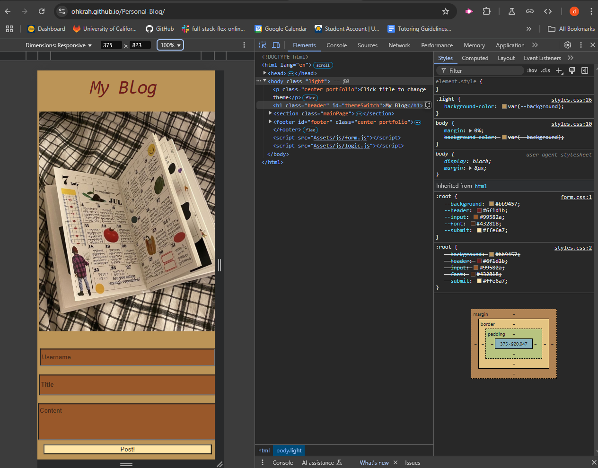

# Personal-Blog
Module 4 challenge

## Description

The challenge of this activity was to create a functional blog site where a user could input their posts and view them on the next page as well as move between the two pages while using the DOM to execute these functions.

## Difficulties

### Form Input

There were two issues with teh forminput that I was able to troubleshoot on my own, the first was the input box value saving on pageload vs. during the submit. This was resolved by moving the function call into an `eventListener` rather than at the end of the script file. The second issue was the arrays nesting repeatedly in local storage. Through the help of Xpert I was able to resolve this causing it to no longer print multiple elements with the same content.

### Form Right-Side Alignment

I had trouble with getting the contents of the form to align with right side of the page rather than all of the elements overlapping/stacking on the left side. With the help of Xpert I was able to resolve this issue by modifying the CSS.

## Resources

>* [Used to find design styles for headers](https://stackoverflow.com/questions/49227493/how-to-make-a-text-cursive-in-css)

>* Xpert for how to change placeholder color

## Screenshot

## Deployed link

[Personal Blog](https://ohkrah.github.io/Personal-Blog/)